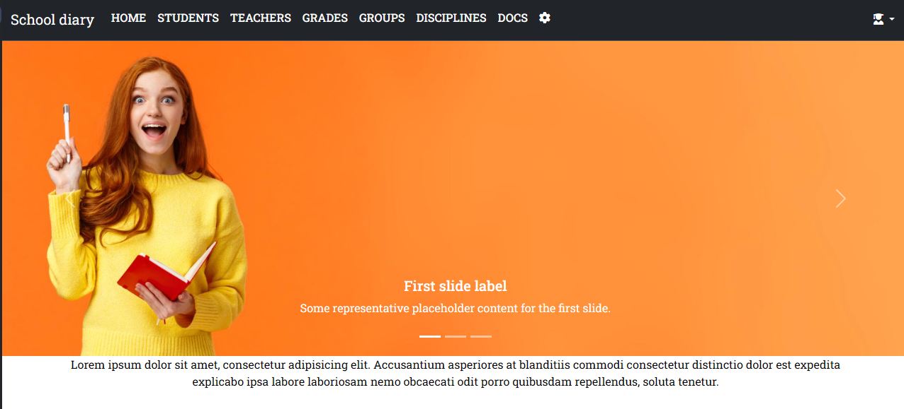
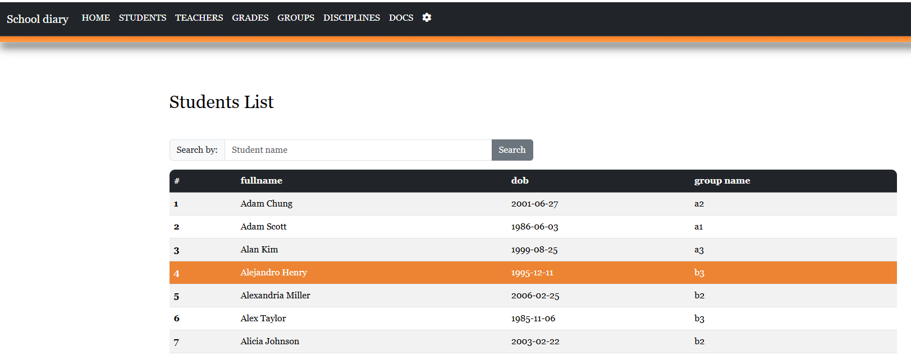
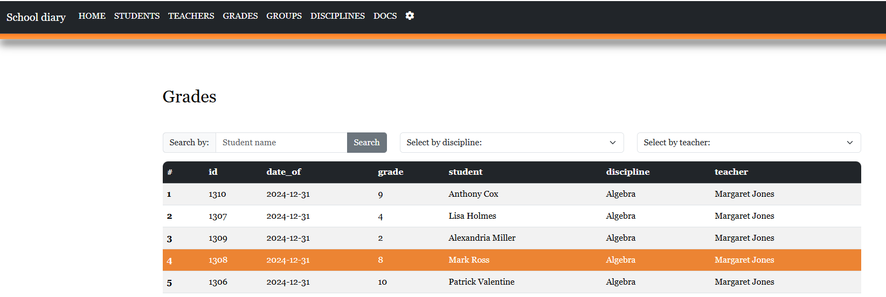
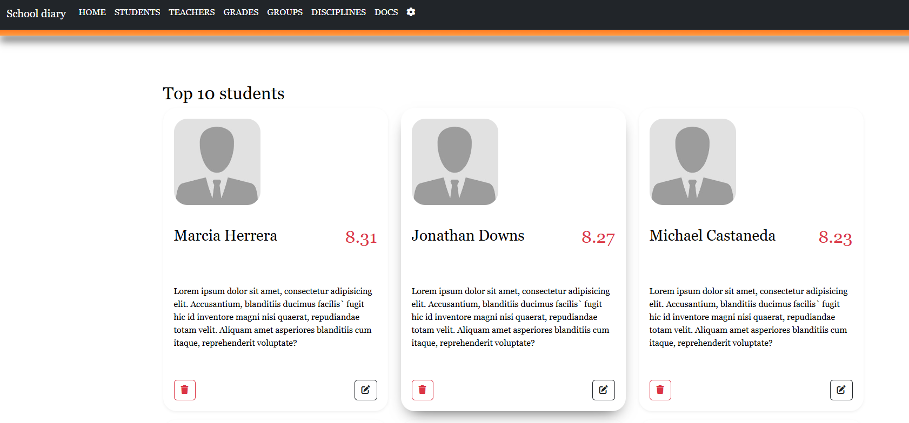

# School Diary (FastAPI)

[](https://github.com/VitaliyLobko/diary/actions/workflows/ci.yml)
[](https://www.python.org/)
[](https://fastapi.tiangolo.com/)
[](LICENSE)

A small school-diary web application: it manages students, teachers, groups,
disciplines and grades, with server-rendered pages (Jinja2 + Bootstrap) on top
of a JSON API. Built as a portfolio project to demonstrate a clean FastAPI
architecture — routers, a repository layer, Pydantic schemas, JWT auth,
role-based access control and Redis caching.

## Features

- REST API with full CRUD for every entity (students, teachers, groups,
  disciplines, grades).
- Server-rendered pages with Jinja2 templates and Bootstrap.
- OAuth2 / JWT authentication with email confirmation.
- Role-based access control (`admin` / `moderator` / `user`).
- Redis caching for user and student lookups.
- Aggregated queries (average grade, top-10 students).
- Fake data generator for quick local seeding (Faker).
- Alembic database migrations.
- Unit and integration tests with Pytest.

## Tech stack

FastAPI · SQLAlchemy 2 · Alembic · PostgreSQL · Redis · Pydantic v2 ·
Jinja2 · Bootstrap · Docker · GitHub Actions

## Project structure

```
main.py                 # FastAPI app: middleware, routers, static, entrypoint
src/
  conf/                 # Pydantic settings (env-driven configuration)
  database/             # SQLAlchemy engine, session and ORM models
  schemas/              # Pydantic request/response models
  repository/           # Data-access layer (DB queries)
  routes/               # API routers and page handlers
  services/             # Auth, roles, email, Redis cache
migrations/             # Alembic migrations
templates/              # Jinja2 templates
static/                 # CSS, JS, images
tests/                  # Pytest suite
```

## Getting started

### Option 1 — Docker (recommended)

```bash
cp .env.example .env          # optional: adjust secrets
docker compose up --build
```

The API and pages are served at http://localhost:8000, PostgreSQL and Redis
start automatically, and database migrations are applied on startup.

### Option 2 — Local

Requires Python 3.12 and a running PostgreSQL. The easiest way to get the
database (and Redis) is to start just those services from the compose file.

```bash
docker compose up -d db redis   # PostgreSQL + Redis only

python -m venv .venv
source .venv/bin/activate      # Windows: .venv\Scripts\activate
pip install -r requirements.txt

cp .env.example .env           # optional — the defaults already point at the compose db
alembic upgrade head           # apply migrations
uvicorn main:app --reload
```

### Configuration

All settings are read from environment variables (or a local `.env`) and have
safe development defaults — see [.env.example](.env.example). Key variables:

| Variable       | Description                        | Default (dev)                |
|----------------|------------------------------------|------------------------------|
| `DATABASE_URL` | SQLAlchemy database URL (Postgres) | `postgresql://…/sdiary`      |
| `SECRET_KEY`   | JWT signing key (**set in prod**)  | `dev-secret-change-me`       |
| `REDIS_HOST`   | Redis host                         | `localhost`                  |
| `MAIL_*`       | SMTP settings for confirmation mail| placeholders                 |

## API documentation

Interactive OpenAPI docs are available once the app is running:

- Swagger UI — http://localhost:8000/docs
- ReDoc — http://localhost:8000/redoc

To populate the database with demo data, sign in as an admin and call
`GET /seed/`.

## Running tests

The suite runs against a real PostgreSQL that is started automatically in a
throwaway container (via [testcontainers]), so **Docker must be running** — no
manual database setup is needed.

```bash
pip install -r requirements-dev.txt
ruff check .
pytest
```

[testcontainers]: https://testcontainers.com/

## Screenshots






## License

Released under the [MIT License](LICENSE).

## Author

Developed by **Vitaliy Lobko** — [Telegram](https://t.me/MrLakin)
